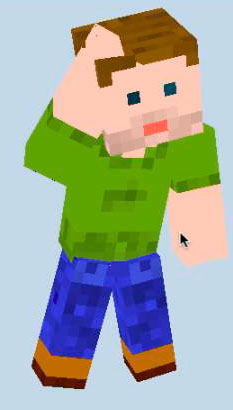

#Voxel-Zigfu#
##A module to pupeteer a voxel person with an OpenNI/NITE-enabled depth sensor (like the Xbox Kinect).##

Presently the API is very simple.  Just pass voxel-zigfu a minecraft-skin of your choice, and voxel-zigfu will take care of the puppeteering the limbs as you move in front of your OpenNI-enabled depth sensor of choice.  Designed for use with Voxel.js.  Here it is, tacked on to the end of the minecraft-skin sample code:

	var skin = require('minecraft-skin')
	var viking = skin(THREE, 'viking.png')
	viking.mesh.position.y = 50
	scene.add(viking.mesh)

	var zigfu = require('voxel-zigfu')
	zigfu.puppeteer(viking)
Please note you will need to include the Zigfu source in your HTML page, and you will need their extension installed in your browser.  You can get that at [zigfu.com](http://zigfu.com/).