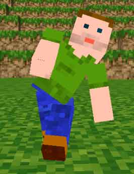

#Voxel-Zigfu#
##A module to pupeteer a voxel person with an OpenNI/NITE-enabled depth sensor (like the Xbox Kinect).##
[Run working example](http://danfinlay.com/projects/voxeljs/zigfu)

Presently the API is very simple.  Just pass voxel-zigfu a minecraft-skin of your choice, and voxel-zigfu will take care of the puppeteering the limbs as you move in front of your OpenNI-enabled depth sensor of choice.  Designed for use with [Voxel.js](www.voxeljs.com).  Here it is, tacked on to the end of the minecraft-skin sample code:

	var kinect = require('voxel-zigfu')
	var skin = require('minecraft-skin')

	window.dan = skin(game.THREE, 'danf.png')
	var danObject = dan.mesh
	kinect.puppeteer(dan)
	game.scene.add(danObject)
	game.addItem(dan)
	dan.mesh.position.y=50

Please note you will need to include the Zigfu source in your HTML page, and you will need their extension installed in your browser.  You can get that at [zigfu.com](http://zigfu.com/).

You can run a demo of the module using browserify and http-server.  First make sure you have them both installed like so:

	npm install browserify -g
	npm install http-server -g
Then you can build the demo site and run it from your terminal:

	browserify demo.js -o bundle.js
	http-server
This will open a port on your localhost that you can open with your browser.